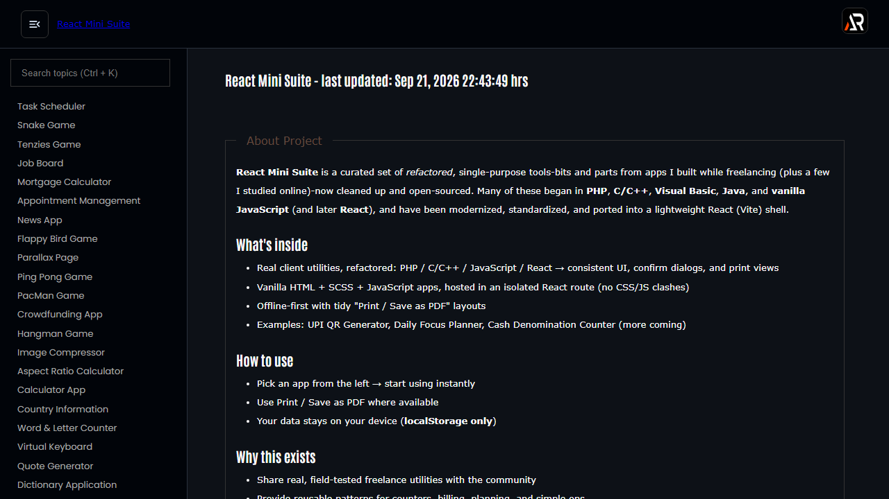

# React Mini Suite

A broad frontend collection of practical tools, games and small client-side applications built with React and Vite. The shared shell provides lazy routes, independent navigation scrolling and a responsive menu for exploring each app.



## Features

- Large collection of focused utilities, games, generators and planners
- Lazy-loaded routes with searchable navigation
- Responsive fixed header, independently scrolling menu and floating go-top control
- Local browser state where each app needs it
- GitHub Pages SPA deployment support

## Tech stack

React, React Router, Vite, styled-components, Material UI, react-icons and selected client-side utilities.

## Run locally

```bash
npm install
npm run dev
```

Build and deploy:

```bash
npm run lint
npm run build
npm run deploy
```

Live: https://a2rp.github.io/react-mini-suite/

## Links

- Portfolio: https://www.ashishranjan.net/
- GitHub: https://github.com/a2rp
- CodePen: https://codepen.io/ash1198
- LinkedIn: https://www.linkedin.com/in/aashishranjan
- Facebook: https://www.facebook.com/theash.ashish/
- YouTube: https://www.youtube.com/@ashishranjan-ashz?sub_confirmation=1
- Email: mailto:ash.ranjan09@gmail.com

## Support

- Support: https://a2rp-donation-page.netlify.app/
- Buy Me a Coffee: https://buymeacoffee.com/a2rp
- Patreon: https://patreon.com/a2rp